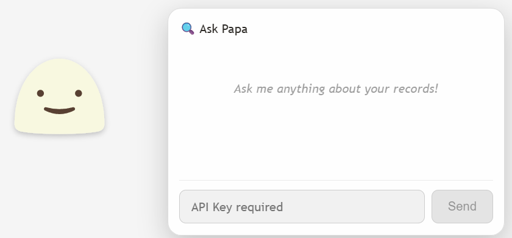
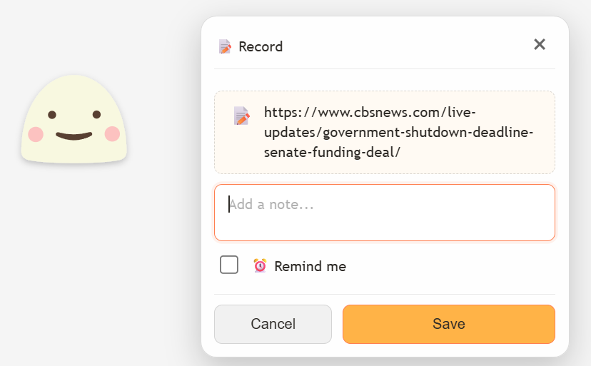
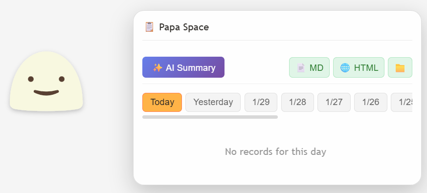

<p align="center">
  
</p>

<h1 align="center">Papa Pet</h1>

<p align="center">
  <strong>Your Intelligent Desktop Companion for Effortless Daily Recording</strong>
</p>

<p align="center">
  <a href="#features">Features</a> •
  <a href="#installation">Installation</a> •
  <a href="#usage">Usage</a> •
  <a href="#tech-stack">Tech Stack</a> •
  <a href="#architecture">Architecture</a> •
  <a href="#roadmap">Roadmap</a>
</p>

<p align="center">
  
  
  
  
  
</p>

<p align="center">
  
</p>

---

## What is Papa Pet?

Papa Pet is a **lightweight, always-on-top desktop companion** that helps you capture and organize your daily work effortlessly. Simply drag files, screenshots, or text onto Papa, add a quick note, set a reminder if needed, and get back to work. Papa handles the rest.

> **Philosophy**: Capture first, organize later. Papa Pet is designed to be your low-friction daily recorder that stays out of the way but is always there when you need it.

---

## Features

### Core Features

| Feature                         | Description                                                                 |
| ------------------------------- | --------------------------------------------------------------------------- |
| **Drag & Drop Recording** | Drop files, images, or text directly onto Papa to create instant records    |
| **Smart Reminders**       | Set quick reminders (10min, 1hr, tomorrow, 3 days) attached to your records |
| **Papa Space**            | Your personal timeline view - browse, edit, and manage all your records     |
| **Daily Export**          | Generate beautiful Markdown or HTML summaries of your day                   |
| **AI Integration**        | Optional LLM support (OpenAI/Anthropic) for summaries and insights          |

### Pet Behaviors

<table>
<tr>
<td width="50%">

### Screenshots

<p align="center">
  
  
  
</p>

---

## Installation

### Prerequisites

- [Node.js](https://nodejs.org/) >= 18.0
- [pnpm](https://pnpm.io/) (recommended) or npm
- [Rust](https://www.rust-lang.org/tools/install) >= 1.70
- Platform-specific dependencies for [Tauri](https://tauri.app/v1/guides/getting-started/prerequisites)

### Quick Start

```bash
# Clone the repository
git clone https://github.com/yourusername/papa-pet.git
cd papa-pet

# Install dependencies
pnpm install

# Run in development mode
pnpm tauri dev

# Build for production
pnpm tauri build
```

---

## Usage

### Basic Operations

| Action                     | How to                                  |
| -------------------------- | --------------------------------------- |
| **Record a file**    | Drag & drop any file onto Papa          |
| **Record text**      | Select text in any app, drag onto Papa  |
| **Add reminder**     | Toggle "Remind me" in the record panel  |
| **Open Papa Space**  | Right-click → Papa Space               |
| **Change settings**  | Right-click → Settings                 |
| **Hide temporarily** | Right-click → Hide 10s                 |
| **Sleep mode**       | Right-click → Sleep (stops animations) |

### Keyboard Shortcuts

| Shortcut   | Action                           |
| ---------- | -------------------------------- |
| `Escape` | Close current panel              |
| `Enter`  | Save record (when panel is open) |

### LLM Configuration

1. Right-click Papa → **Settings**
2. Select your **Provider** (OpenAI or Anthropic)
3. Choose a **Model**
4. Enter your **API Key**
5. Click **Save & Close**

---

## Tech Stack

<table>
<tr>
<td align="center" width="100">

<br><strong>Tauri v2</strong>
<br><sub>Desktop Framework</sub>
</td>
<td align="center" width="100">

<br><strong>React 18</strong>
<br><sub>UI Library</sub>
</td>
<td align="center" width="100">

<br><strong>TypeScript</strong>
<br><sub>Type Safety</sub>
</td>
<td align="center" width="100">

<br><strong>Rust</strong>
<br><sub>Backend</sub>
</td>
<td align="center" width="100">

<br><strong>SQLite</strong>
<br><sub>Database</sub>
</td>
</tr>
</table>

### Additional Libraries

- **GSAP** + MorphSVGPlugin - Smooth mouth animations
- **Anime.js** - Eye tracking animations
- **device_query** - Global input monitoring (Rust)
- **reqwest** - HTTP client for LLM APIs (Rust)

---

## Architecture

```
papa-pet/
├── src/                    # Frontend (React + TypeScript)
│   ├── components/         # UI Components
│   │   ├── ContextMenu.tsx
│   │   ├── RecordPanel.tsx
│   │   ├── ReminderToast.tsx
│   │   ├── SettingsPanel.tsx
│   │   └── PapaSpacePanel.tsx
│   ├── hooks/              # Custom React Hooks
│   │   ├── useLlmSettings.ts
│   │   ├── useReminder.ts
│   │   ├── usePapaSpace.ts
│   │   └── useRecordPanel.ts
│   ├── services/           # API Layer
│   │   └── api.ts
│   ├── types/              # TypeScript Types
│   ├── constants/          # App Constants
│   ├── utils/              # Helper Functions
│   └── App.tsx             # Main Component
│
├── src-tauri/              # Backend (Rust)
│   ├── src/
│   │   └── main.rs         # Tauri Commands & Events
│   └── tauri.conf.json     # Tauri Configuration
│
└── public/                 # Static Assets
    └── assets/
```

### Data Flow

```
┌─────────────┐     Drag & Drop      ┌─────────────┐
│   User      │ ──────────────────▶  │   Papa Pet  │
└─────────────┘                      └──────┬──────┘
                                            │
                    ┌───────────────────────┼───────────────────────┐
                    │                       │                       │
                    ▼                       ▼                       ▼
            ┌───────────┐           ┌───────────┐           ┌───────────┐
            │  Record   │           │  Reminder │           │  Export   │
            │  Panel    │           │  System   │           │  Engine   │
            └─────┬─────┘           └─────┬─────┘           └─────┬─────┘
                  │                       │                       │
                  └───────────────────────┼───────────────────────┘
                                          │
                                          ▼
                                   ┌─────────────┐
                                   │   SQLite    │
                                   │   Database  │
                                   └─────────────┘
```

---

## Database Schema

Papa Pet uses SQLite with the following tables:

| Table               | Purpose                                      |
| ------------------- | -------------------------------------------- |
| `timeline_events` | Core records (files, images, text, thoughts) |
| `attachments`     | File/image metadata linked to events         |
| `reminders`       | Scheduled reminders attached to events       |
| `daily_exports`   | Export history and file paths                |
| `settings`        | User preferences (key-value store)           |

---

## Development

### Commands

```bash
# Development
pnpm tauri dev          # Run with hot reload

# Build
pnpm build              # Build frontend only
pnpm tauri build        # Build full application

# Lint & Format
pnpm lint               # Run ESLint
pnpm format             # Run Prettier
```

### Database Location

The SQLite database is stored in your platform's app data directory:

- **Windows**: `%APPDATA%\papa-pet\`
- **macOS**: `~/Library/Application Support/papa-pet/`
- **Linux**: `~/.local/share/papa-pet/`

---

## Contributing

Contributions are welcome! Please feel free to submit a Pull Request.

1. Fork the repository
2. Create your feature branch (`git checkout -b feature/AmazingFeature`)
3. Commit your changes (`git commit -m 'Add some AmazingFeature'`)
4. Push to the branch (`git push origin feature/AmazingFeature`)
5. Open a Pull Request

---

## License

**Non-Commercial Use Only**

This project is provided for personal and educational use only. Commercial use is strictly prohibited without explicit written permission from the author.

See the [LICENSE](LICENSE) file for details.

---

## Acknowledgments

- [Tauri](https://tauri.app/) - For the amazing desktop framework
- [GSAP](https://greensock.com/gsap/) - For smooth animations
- [Anime.js](https://animejs.com/) - For eye tracking animations

---

<p align="center">
  <strong>Made with love by the Papa Pet Team</strong>
</p>

<p align="center">
  <a href="https://github.com/yourusername/papa-pet/issues">Report Bug</a> •
  <a href="https://github.com/yourusername/papa-pet/issues">Request Feature</a>
</p>
